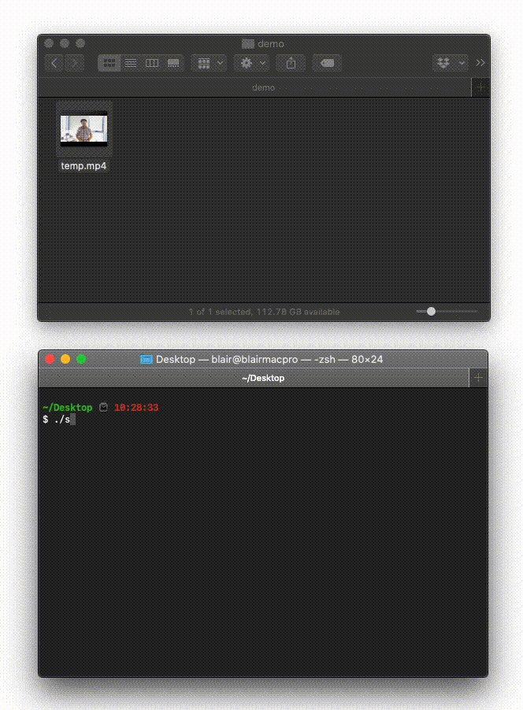
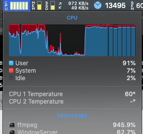

# videostreamer

This is a shell script that enables you to stream a pre-made video file from your computer to a video-streaming service like Facebook, YouTube, etc. I developed it for my church (www.oneheart.sydney) in response to the COVID-19 crisis and social-distancing lockdown. We ended up using FB/YT "Premiere" but I noticed some churches still like to go with "LIVE" for whatever reason so I'm sharing this here in case it benefits anyone. :)

## 1. Installing ffmpeg with OpenSSL on Mac

This part adapted from https://gist.github.com/Piasy/b5dfd5c048eb69d1b91719988c0325d8

You'll need to run the below in the Terminal. Note that you will first have to have Homebrew set up, https://brew.sh/

```bash
brew uninstall --force --ignore-dependencies ffmpeg
brew install chromaprint amiaopensource/amiaos/decklinksdk
brew tap homebrew-ffmpeg/ffmpeg
brew install homebrew-ffmpeg/ffmpeg/ffmpeg $(brew options homebrew-ffmpeg/ffmpeg/ffmpeg | grep -vE '\s' | grep -- '--with-' | grep -vi chromaprint | grep -vi game-music-emu | tr '\n' ' ')
```

I imagine you could also get this working on Linux and Microsoft Windows (via WSL) if you can compile `ffmpeg` with `openssl` support. Haven't had a chance to test that myself, but this looks promising: https://askubuntu.com/questions/650577/how-to-compile-ffmpeg-with-https-support

## 2. Creating the shell script
This assumes AAC encoding for the audio. If it isn't already AAC-encoded, use HandBrake to fix that up first: https://handbrake.fr/

Some comments:

- Set `RTMP_URL` annd `RTMP_KEY` based on what Facebook/YouTube/etc. assign to you when you set up a new livestream.
- Set `PIXELS_WIDE` to the _horizontal_ pixel count that you want to broadcast at. For example, for 720p, this number should be set to `1280` for a 16:9 video (1280x720); for 1080p, this number should be set to `1920` for a 16:9 video (1920x1080).
- Ensure that you use the `rtmps` protocol on Facebook, the `s` makes it secure. Using just `rtmp` (as most tutorials on the Internet seem to recommed) will cause Facebook to reject your upload.
- Don't change `yuv420p`. The "420p" doesn't refer to a resolution of 420 pixels tall, it's a colour setting.

```bash
RTMP_URL="rtmps://rtmp-api.facebook.com:443/rtmp"
RTMP_KEY="blahblahblah" #y your key goes here
PIXELS_WIDE="1280"

ffmpeg -re -i $1 \
	-deinterlace \
	-c:a copy -b:a 128k -ar 44100 \
	-vcodec libx264 -vf scale=$PIXELS_WIDE:-1 -pix_fmt yuv420p \
	-acodec aac -strict -2 \
	-flags +global_header \
	-r 30 -g 60 \
	-f flv "$RTMP_URL/$RTMP_KEY"
```

## 3. Running the shell script

Save the shell script above to your Desktop (e.g. `stream.sh`), give it appropriate permissions (e.g. `chmod +x stream.sh`). Then you can stream the video like so: `./stream.sh sunday200419.mp4`.

On Mac you can just drag and drop the file into the Terminal window and it will set the parameter... handy!




## Performance (totally unscientific observations)

- I'm on NBN50, using a 2012 Mac Pro with 3.06GHz 6-core Xeon and NVIDIA GeForce GT 640 2 GB graphics
- I tried streaming a 5 minute 1080p MP4 file to Facebook, had about 10% of frames drop
- I tried streaming the same file at 720p to Facebook, had <1% of frames drop


